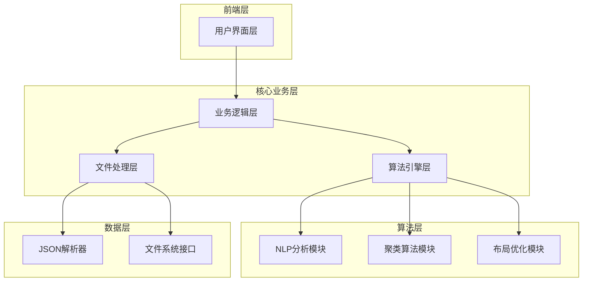
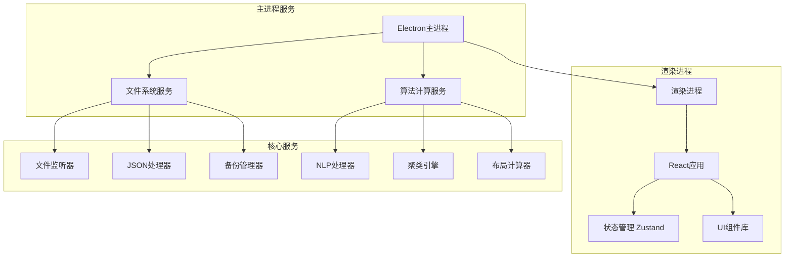
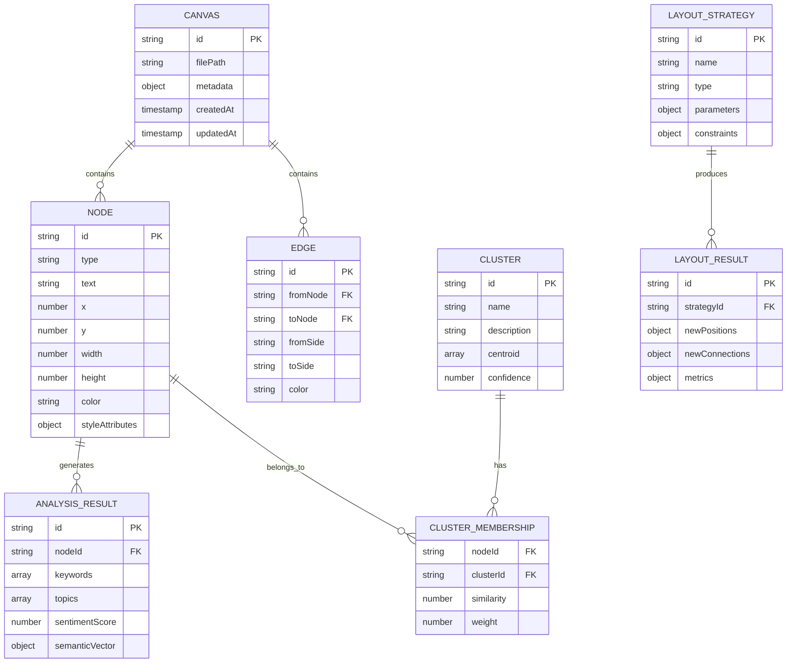

# Obsidian Canvas 自动整理Agent 技术架构文档

## 1. 架构设计



## 2. 技术描述

* 前端：Electron\@28 + React\@18 + TypeScript\@5 + Ant Design\@5 + Tailwind CSS\@3

* 算法引擎：Node.js\@20 + natural\@6 + ml-kmeans\@6 + d3-force\@3

* 文件处理：fs-extra\@11 + chokidar\@3 + fast-json-patch\@3

* 构建工具：Vite\@5 + Electron Builder\@24

## 3. 路由定义

| 路由            | 目的                   |
| ------------- | -------------------- |
| /dashboard    | 主仪表板，显示项目概览和快速操作     |
| /file-manager | 文件管理页面，Canvas文件导入和管理 |
| /analysis     | 智能分析页面，内容分析和主题识别     |
| /strategy     | 整理策略页面，策略选择和参数配置     |
| /preview      | 预览对比页面，整理前后效果对比      |
| /batch        | 批量处理页面，多文件处理队列管理     |
| /settings     | 设置页面，应用配置和偏好设置       |

## 4. API定义

### 4.1 核心API

文件处理相关

```
POST /api/canvas/parse
```

请求:

| 参数名      | 参数类型         | 是否必需  | 描述            |
| -------- | ------------ | ----- | ------------- |
| filePath | string       | true  | Canvas文件的绝对路径 |
| options  | ParseOptions | false | 解析选项配置        |

响应:

| 参数名     | 参数类型       | 描述             |
| ------- | ---------- | -------------- |
| success | boolean    | 解析是否成功         |
| data    | CanvasData | 解析后的Canvas数据结构 |
| error   | string     | 错误信息（如果有）      |

示例:

```json
{
  "filePath": "C:/path/to/canvas.canvas",
  "options": {
    "validateStructure": true,
    "extractMetadata": true
  }
}
```

内容分析相关

```
POST /api/analysis/analyze
```

请求:

| 参数名          | 参数类型            | 是否必需  | 描述                                      |
| ------------ | --------------- | ----- | --------------------------------------- |
| nodes        | Node\[]         | true  | Canvas节点数组                              |
| analysisType | string          | true  | 分析类型：'semantic', 'keyword', 'structure' |
| options      | AnalysisOptions | false | 分析选项                                    |

响应:

| 参数名           | 参数类型            | 描述       |
| ------------- | --------------- | -------- |
| clusters      | Cluster\[]      | 识别出的主题聚类 |
| keywords      | string\[]       | 提取的关键词   |
| relationships | Relationship\[] | 节点间关系    |

布局优化相关

```
POST /api/layout/optimize
```

请求:

| 参数名         | 参数类型              | 是否必需  | 描述         |
| ----------- | ----------------- | ----- | ---------- |
| canvas      | CanvasData        | true  | 原始Canvas数据 |
| strategy    | LayoutStrategy    | true  | 布局策略配置     |
| constraints | LayoutConstraints | false | 布局约束条件     |

响应:

| 参数名             | 参数类型            | 描述           |
| --------------- | --------------- | ------------ |
| optimizedCanvas | CanvasData      | 优化后的Canvas数据 |
| changes         | LayoutChange\[] | 布局变更记录       |
| metrics         | LayoutMetrics   | 布局质量指标       |

## 5. 服务架构图



## 6. 数据模型

### 6.1 数据模型定义



### 6.2 数据定义语言

核心数据结构定义：

```typescript
// Canvas数据结构
interface CanvasData {
  nodes: Node[];
  edges: Edge[];
  metadata?: CanvasMetadata;
}

interface Node {
  id: string;
  type: 'text' | 'file' | 'link' | 'group';
  text: string;
  x: number;
  y: number;
  width: number;
  height: number;
  color?: string;
  styleAttributes?: Record<string, any>;
}

interface Edge {
  id: string;
  fromNode: string;
  toNode: string;
  fromSide: 'top' | 'right' | 'bottom' | 'left';
  toSide: 'top' | 'right' | 'bottom' | 'left';
  color?: string;
  label?: string;
}

// 分析结果结构
interface AnalysisResult {
  nodeId: string;
  keywords: string[];
  topics: Topic[];
  semanticVector: number[];
  sentimentScore: number;
  importance: number;
}

interface Topic {
  name: string;
  confidence: number;
  keywords: string[];
}

// 聚类结果结构
interface Cluster {
  id: string;
  name: string;
  nodes: string[];
  centroid: number[];
  coherence: number;
  boundingBox: BoundingBox;
}

interface BoundingBox {
  x: number;
  y: number;
  width: number;
  height: number;
}

// 布局策略结构
interface LayoutStrategy {
  type: 'grid' | 'force' | 'hierarchical' | 'circular' | 'organic';
  parameters: LayoutParameters;
  constraints: LayoutConstraints;
}

interface LayoutParameters {
  spacing: number;
  padding: number;
  alignment: 'left' | 'center' | 'right' | 'justify';
  grouping: boolean;
  preserveConnections: boolean;
}

interface LayoutConstraints {
  minDistance: number;
  maxDistance: number;
  boundaryBox?: BoundingBox;
  fixedNodes?: string[];
  avoidOverlap: boolean;
}

// 处理任务结构
interface ProcessingTask {
  id: string;
  filePath: string;
  strategy: LayoutStrategy;
  status: 'pending' | 'processing' | 'completed' | 'failed';
  progress: number;
  startTime: Date;
  endTime?: Date;
  error?: string;
  result?: CanvasData;
}
```

## 7. 算法实现详解

### 7.1 文本分析算法

```typescript
class TextAnalyzer {
  private nlp: any;
  private vectorizer: TfIdfVectorizer;
  
  constructor() {
    this.nlp = require('natural');
    this.vectorizer = new TfIdfVectorizer();
  }
  
  async analyzeText(text: string): Promise<AnalysisResult> {
    // 1. 文本预处理
    const cleanText = this.preprocessText(text);
    
    // 2. 关键词提取
    const keywords = this.extractKeywords(cleanText);
    
    // 3. 主题识别
    const topics = await this.identifyTopics(cleanText);
    
    // 4. 语义向量化
    const semanticVector = this.vectorizer.transform(cleanText);
    
    // 5. 情感分析
    const sentimentScore = this.nlp.SentimentAnalyzer.getSentiment(cleanText);
    
    return {
      keywords,
      topics,
      semanticVector,
      sentimentScore,
      importance: this.calculateImportance(keywords, topics)
    };
  }
  
  private preprocessText(text: string): string {
    return text
      .toLowerCase()
      .replace(/[^\w\s\u4e00-\u9fff]/g, '') // 保留中英文字符
      .replace(/\s+/g, ' ')
      .trim();
  }
  
  private extractKeywords(text: string): string[] {
    const tokens = this.nlp.WordTokenizer().tokenize(text);
    const tfidf = new this.nlp.TfIdf();
    tfidf.addDocument(tokens);
    
    const keywords: string[] = [];
    tfidf.listTerms(0).slice(0, 10).forEach((item: any) => {
      keywords.push(item.term);
    });
    
    return keywords;
  }
}
```

### 7.2 聚类算法实现

```typescript
class ClusteringEngine {
  private kmeans: any;
  private dbscan: any;
  
  constructor() {
    this.kmeans = require('ml-kmeans');
    this.dbscan = require('ml-dbscan');
  }
  
  async clusterNodes(nodes: Node[], analysisResults: AnalysisResult[]): Promise<Cluster[]> {
    // 1. 构建特征矩阵
    const featureMatrix = this.buildFeatureMatrix(analysisResults);
    
    // 2. 确定最优聚类数
    const optimalK = this.findOptimalK(featureMatrix);
    
    // 3. 执行K-means聚类
    const kmeansResult = this.kmeans(featureMatrix, optimalK);
    
    // 4. 使用DBSCAN优化边界
    const dbscanResult = this.dbscan(featureMatrix, 0.5, 3);
    
    // 5. 合并聚类结果
    const clusters = this.mergeClusters(kmeansResult, dbscanResult, nodes);
    
    return clusters;
  }
  
  private buildFeatureMatrix(analysisResults: AnalysisResult[]): number[][] {
    return analysisResults.map(result => [
      ...result.semanticVector,
      result.sentimentScore,
      result.importance
    ]);
  }
  
  private findOptimalK(data: number[][]): number {
    const maxK = Math.min(10, Math.floor(data.length / 2));
    let bestK = 2;
    let bestScore = -Infinity;
    
    for (let k = 2; k <= maxK; k++) {
      const result = this.kmeans(data, k);
      const score = this.calculateSilhouetteScore(data, result.clusters);
      
      if (score > bestScore) {
        bestScore = score;
        bestK = k;
      }
    }
    
    return bestK;
  }
}
```

### 7.3 布局优化算法

```typescript
class LayoutOptimizer {
  private forceSimulation: any;
  
  constructor() {
    this.forceSimulation = require('d3-force');
  }
  
  async optimizeLayout(
    canvas: CanvasData, 
    clusters: Cluster[], 
    strategy: LayoutStrategy
  ): Promise<CanvasData> {
    switch (strategy.type) {
      case 'force':
        return this.forceDirectedLayout(canvas, clusters, strategy);
      case 'grid':
        return this.gridLayout(canvas, clusters, strategy);
      case 'hierarchical':
        return this.hierarchicalLayout(canvas, clusters, strategy);
      default:
        return this.organicLayout(canvas, clusters, strategy);
    }
  }
  
  private async forceDirectedLayout(
    canvas: CanvasData, 
    clusters: Cluster[], 
    strategy: LayoutStrategy
  ): Promise<CanvasData> {
    const simulation = this.forceSimulation.forceSimulation(canvas.nodes)
      .force('link', this.forceSimulation.forceLink(canvas.edges).id((d: any) => d.id))
      .force('charge', this.forceSimulation.forceManyBody().strength(-300))
      .force('center', this.forceSimulation.forceCenter(0, 0))
      .force('collision', this.forceSimulation.forceCollide().radius(50));
    
    // 添加聚类约束力
    simulation.force('cluster', this.createClusterForce(clusters));
    
    // 运行模拟
    for (let i = 0; i < 300; i++) {
      simulation.tick();
    }
    
    // 更新节点位置
    const optimizedNodes = canvas.nodes.map(node => ({
      ...node,
      x: Math.round(node.x),
      y: Math.round(node.y)
    }));
    
    return {
      ...canvas,
      nodes: optimizedNodes
    };
  }
  
  private createClusterForce(clusters: Cluster[]) {
    return (alpha: number) => {
      clusters.forEach(cluster => {
        const centerX = cluster.boundingBox.x + cluster.boundingBox.width / 2;
        const centerY = cluster.boundingBox.y + cluster.boundingBox.height / 2;
        
        cluster.nodes.forEach(nodeId => {
          const node = canvas.nodes.find(n => n.id === nodeId);
          if (node) {
            const dx = centerX - node.x;
            const dy = centerY - node.y;
            const distance = Math.sqrt(dx * dx + dy * dy);
            
            if (distance > 0) {
              const force = alpha * 0.1;
              node.vx += dx * force;
              node.vy += dy * force;
            }
          }
        });
      });
    };
  }
}
```

## 8. 性能优化策略

### 8.1 计算性能优化

```typescript
class PerformanceOptimizer {
  private workerPool: Worker[];
  private cache: Map<string, any>;
  
  constructor() {
    this.workerPool = this.createWorkerPool(4);
    this.cache = new Map();
  }
  
  async processLargeCanvas(canvas: CanvasData): Promise<CanvasData> {
    // 1. 检查缓存
    const cacheKey = this.generateCacheKey(canvas);
    if (this.cache.has(cacheKey)) {
      return this.cache.get(cacheKey);
    }
    
    // 2. 分块处理
    const chunks = this.chunkNodes(canvas.nodes, 100);
    const results = await Promise.all(
      chunks.map(chunk => this.processChunk(chunk))
    );
    
    // 3. 合并结果
    const mergedResult = this.mergeResults(results);
    
    // 4. 缓存结果
    this.cache.set(cacheKey, mergedResult);
    
    return mergedResult;
  }
  
  private chunkNodes(nodes: Node[], chunkSize: number): Node[][] {
    const chunks: Node[][] = [];
    for (let i = 0; i < nodes.length; i += chunkSize) {
      chunks.push(nodes.slice(i, i + chunkSize));
    }
    return chunks;
  }
  
  private async processChunk(chunk: Node[]): Promise<any> {
    return new Promise((resolve, reject) => {
      const worker = this.getAvailableWorker();
      worker.postMessage({ type: 'PROCESS_CHUNK', data: chunk });
      
      worker.onmessage = (event) => {
        if (event.data.type === 'CHUNK_PROCESSED') {
          resolve(event.data.result);
        }
      };
      
      worker.onerror = reject;
    });
  }
}
```

### 8.2 内存管理

```typescript
class MemoryManager {
  private maxMemoryUsage: number;
  private currentMemoryUsage: number;
  
  constructor(maxMemoryMB: number = 512) {
    this.maxMemoryUsage = maxMemoryMB * 1024 * 1024;
    this.currentMemoryUsage = 0;
  }
  
  async processWithMemoryLimit<T>(processor: () => Promise<T>): Promise<T> {
    // 检查内存使用情况
    if (this.currentMemoryUsage > this.maxMemoryUsage * 0.8) {
      await this.garbageCollect();
    }
    
    const startMemory = process.memoryUsage().heapUsed;
    
    try {
      const result = await processor();
      return result;
    } finally {
      const endMemory = process.memoryUsage().heapUsed;
      this.currentMemoryUsage += (endMemory - startMemory);
    }
  }
  
  private async garbageCollect(): Promise<void> {
    if (global.gc) {
      global.gc();
    }
    
    // 清理缓存
    this.clearOldCache();
    
    this.currentMemoryUsage = process.memoryUsage().heapUsed;
  }
}
```

## 9. 错误处理和日志

### 9.1 错误处理策略

```typescript
class ErrorHandler {
  private logger: Logger;
  
  constructor() {
    this.logger = new Logger('CanvasProcessor');
  }
  
  async safeProcess<T>(operation: () => Promise<T>, fallback?: T): Promise<T> {
    try {
      return await operation();
    } catch (error) {
      this.logger.error('Processing failed', error);
      
      if (this.isRecoverableError(error)) {
        return this.attemptRecovery(operation, fallback);
      }
      
      if (fallback !== undefined) {
        return fallback;
      }
      
      throw error;
    }
  }
  
  private async attemptRecovery<T>(
    operation: () => Promise<T>, 
    fallback?: T, 
    maxRetries: number = 3
  ): Promise<T> {
    for (let i = 0; i < maxRetries; i++) {
      try {
        await this.delay(1000 * (i + 1)); // 指数退避
        return await operation();
      } catch (error) {
        this.logger.warn(`Recovery attempt ${i + 1} failed`, error);
      }
    }
    
    if (fallback !== undefined) {
      return fallback;
    }
    
    throw new Error('All recovery attempts failed');
  }
}
```

## 10. 测试策略

### 10.1 单元测试

```typescript
// 算法测试示例
describe('TextAnalyzer', () => {
  let analyzer: TextAnalyzer;
  
  beforeEach(() => {
    analyzer = new TextAnalyzer();
  });
  
  test('should extract keywords correctly', async () => {
    const text = 'This is a test document about machine learning and AI';
    const result = await analyzer.analyzeText(text);
    
    expect(result.keywords).toContain('machine');
    expect(result.keywords).toContain('learning');
    expect(result.keywords.length).toBeGreaterThan(0);
  });
  
  test('should handle empty text', async () => {
    const result = await analyzer.analyzeText('');
    
    expect(result.keywords).toEqual([]);
    expect(result.semanticVector).toEqual([]);
  });
});
```

### 10.2 集成测试

```typescript
describe('Canvas Processing Pipeline', () => {
  test('should process complete canvas file', async () => {
    const testCanvas = {
      nodes: [
        { id: '1', type: 'text', text: 'AI and machine learning', x: 0, y: 0, width: 200, height: 100 },
        { id: '2', type: 'text', text: 'Deep learning algorithms', x: 300, y: 0, width: 200, height: 100 }
      ],
      edges: []
    };
    
    const processor = new CanvasProcessor();
    const result = await processor.process(testCanvas, {
      type: 'force',
      parameters: { spacing: 50, padding: 20 }
    });
    
    expect(result.nodes).toHaveLength(2);
    expect(result.nodes[0].x).not.toBe(testCanvas.nodes[0].x);
  });
});
```

