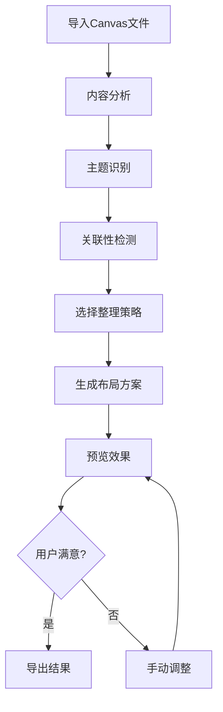

# Obsidian Canvas 卡片笔记自动整理Agent 产品文档

## 1. 产品概述

Obsidian Canvas 自动整理Agent是一个基于AI驱动的智能工具，专门用于自动分析、分类和重新排列Obsidian Canvas文件中的卡片笔记。

* 核心目标：通过智能算法自动优化Canvas布局，提高知识管理效率，减少手动整理时间

* 目标用户：Obsidian用户、知识工作者、研究人员、学生和内容创作者

* 市场价值：将复杂的Canvas整理工作自动化，让用户专注于内容创作而非布局调整

## 2. 核心功能

### 2.1 用户角色

| 角色   | 注册方式  | 核心权限                      |
| ---- | ----- | ------------------------- |
| 普通用户 | 本地安装  | 可处理单个Canvas文件，基础整理功能      |
| 高级用户 | 许可证激活 | 批量处理多个Canvas，高级整理策略，自定义规则 |
| 企业用户 | 企业授权  | 团队协作功能，批量处理，API接口调用       |

### 2.2 功能模块

我们的Canvas整理Agent包含以下主要功能页面：

1. **文件管理页面**：Canvas文件导入、预览、批量选择和处理状态监控
2. **智能分析页面**：卡片内容分析、主题识别、关联性检测和分类建议
3. **整理策略页面**：多种整理模式选择、自定义规则配置、布局参数调整
4. **预览对比页面**：整理前后效果对比、实时预览、手动微调功能
5. **批量处理页面**：多文件处理队列、进度监控、错误日志和结果导出

### 2.3 页面详情

| 页面名称   | 模块名称   | 功能描述                               |
| ------ | ------ | ---------------------------------- |
| 文件管理页面 | 文件导入器  | 支持拖拽导入Canvas文件，自动解析JSON结构，显示文件基本信息 |
| 文件管理页面 | 文件预览器  | 缩略图预览Canvas布局，显示节点数量、连接数量等统计信息     |
| 智能分析页面 | 内容分析引擎 | 使用NLP技术分析卡片文本内容，提取关键词、主题和语义特征      |
| 智能分析页面 | 关联性检测  | 计算卡片间的语义相似度，识别潜在的逻辑关系和分组可能         |
| 整理策略页面 | 策略选择器  | 提供主题分组、时间排序、重要性排列、层次结构等多种整理模式      |
| 整理策略页面 | 参数配置器  | 调整卡片间距、分组边界、连线优化等布局参数              |
| 预览对比页面 | 对比视图   | 并排显示整理前后的Canvas布局，支持缩放和详细查看        |
| 预览对比页面 | 手动调整器  | 允许用户对AI整理结果进行微调，拖拽移动卡片位置           |
| 批量处理页面 | 处理队列   | 管理多个Canvas文件的处理任务，显示处理进度和状态        |
| 批量处理页面 | 结果管理器  | 导出处理结果，生成处理报告，错误日志查看和处理            |

## 3. 核心流程

### 主要用户操作流程

**单文件整理流程：**

1. 用户在文件管理页面导入Canvas文件
2. 系统在智能分析页面自动分析卡片内容和结构
3. 用户在整理策略页面选择整理模式和参数
4. 系统生成整理方案并在预览对比页面展示
5. 用户确认或微调后导出整理结果

**批量处理流程：**

1. 用户选择多个Canvas文件添加到处理队列
2. 配置统一的整理策略和参数
3. 启动批量处理任务
4. 系统依次处理每个文件并生成结果
5. 用户查看处理报告并导出所有结果

## 4. 用户界面设计

### 4.1 设计风格

* **主色调**：深灰色(#2d3748)作为主色，紫色(#805ad5)作为强调色，与Obsidian主题保持一致

* **按钮样式**：圆角矩形按钮，支持悬停渐变效果和点击反馈

* **字体**：系统默认字体，代码和JSON显示使用等宽字体(JetBrains Mono)

* **布局风格**：左侧功能导航，主区域内容展示，右侧属性面板的三栏布局

* **图标风格**：线性图标配合填充图标，支持主题色彩和暗色模式适配

### 4.2 页面设计概览

| 页面名称   | 模块名称   | UI元素                    |
| ------ | ------ | ----------------------- |
| 文件管理页面 | 文件导入区  | 虚线边框拖拽区域，文件图标，进度条，状态标签  |
| 智能分析页面 | 分析结果展示 | 词云图，主题标签云，关联性热力图，统计图表   |
| 整理策略页面 | 策略选择面板 | 卡片式策略选项，滑块参数调节器，开关按钮组   |
| 预览对比页面 | 对比视图   | 分屏显示，缩放控制器，高亮差异标记，操作工具栏 |
| 批量处理页面 | 任务队列   | 表格式任务列表，进度条，状态图标，操作按钮组  |

### 4.3 响应式设计

采用桌面优先的响应式设计，支持1920x1080及以上分辨率的最佳体验，同时兼容1366x768等较小屏幕，确保在不同显示器上都能正常使用。

## 5. 技术架构

### 5.1 核心技术栈

* **前端框架**：Electron + React 18 + TypeScript

* **UI组件库**：Ant Design + Tailwind CSS

* **状态管理**：Zustand

* **文件处理**：Node.js File System API

* **AI分析**：本地NLP库 + OpenAI API（可选）

### 5.2 算法模块

* **文本分析**：TF-IDF + Word2Vec语义分析

* **聚类算法**：K-means + DBSCAN自适应聚类

* **布局优化**：力导向图算法 + 遗传算法优化

* **相似度计算**：余弦相似度 + 编辑距离

### 5.3 数据处理流程

1. **JSON解析**：解析Canvas文件结构，提取节点和边信息
2. **内容提取**：从节点中提取文本内容，清理格式标记
3. **特征提取**：计算文本特征向量，生成语义表示
4. **聚类分析**：基于特征向量进行聚类，识别主题分组
5. **布局计算**：根据聚类结果和连接关系计算最优布局
6. **结果生成**：生成新的Canvas JSON文件

## 6. 整理策略详解

### 6.1 主题分组策略

* **语义聚类**：基于文本语义相似度自动分组

* **关键词分组**：根据共同关键词进行分类

* **标签分组**：识别和利用现有的标签信息

* **层次分组**：创建主题-子主题的层次结构

### 6.2 布局优化策略

* **网格布局**：规整的网格排列，适合结构化内容

* **有机布局**：自然的聚类分布，适合创意思维

* **层次布局**：树状或金字塔结构，适合知识体系

* **时间轴布局**：按时间顺序排列，适合过程记录

### 6.3 连接优化策略

* **最短路径**：优化连线路径，减少交叉

* **逻辑关联**：基于内容相关性建立新连接

* **层次连接**：建立父子级别的连接关系

* **清理冗余**：移除不必要的重复连接

## 7. 高级功能

### 7.1 自定义规则引擎

* **规则编辑器**：可视化规则配置界面

* **条件匹配**：基于内容、位置、连接等条件

* **动作定义**：移动、分组、连接、标记等操作

* **规则模板**：预设常用规则模板库

### 7.2 智能建议系统

* **布局建议**：分析当前布局问题并提供改进建议

* **内容建议**：识别缺失的连接或相关内容

* **优化建议**：提供性能和可读性优化建议

* **学习适应**：根据用户操作习惯调整建议策略

### 7.3 协作功能

* **版本控制**：跟踪Canvas文件的修改历史

* **冲突解决**：处理多人编辑时的冲突情况

* **共享模板**：分享和使用他人的整理策略

* **团队规范**：建立团队统一的整理标准

## 8. 性能优化

### 8.1 处理性能

* **增量处理**：只处理变更的部分，提高处理速度

* **并行计算**：利用多核CPU并行处理大型Canvas

* **内存优化**：流式处理大文件，避免内存溢出

* **缓存机制**：缓存分析结果，避免重复计算

### 8.2 用户体验优化

* **实时预览**：参数调整时实时显示效果

* **进度反馈**：详细的处理进度和剩余时间显示

* **错误恢复**：处理失败时的自动恢复和重试机制

* **撤销重做**：支持多步操作的撤销和重做

## 9. 安全和隐私

### 9.1 数据安全

* **本地处理**：所有数据处理在本地进行，不上传到云端

* **文件备份**：自动备份原始文件，防止数据丢失

* **加密存储**：敏感配置信息加密存储

* **权限控制**：严格的文件访问权限管理

### 9.2 隐私保护

* **无数据收集**：不收集用户的个人信息和文件内容

* **离线运行**：支持完全离线模式运行

* **透明处理**：所有处理过程对用户透明可见

* **用户控制**：用户完全控制数据的使用和处理

## 10. 部署和维护

### 10.1 安装部署

* **一键安装**：提供Windows、macOS、Linux的安装包

* **绿色版本**：支持免安装的便携版本

* **插件集成**：可作为Obsidian插件直接安装

* **自动更新**：支持自动检查和更新功能

### 10.2 维护支持

* **日志系统**：详细的操作和错误日志记录

* **诊断工具**：内置系统诊断和问题排查工具

* **用户反馈**：便捷的问题反馈和建议收集机制

* **文档支持**：完整的用户手册和API文档

