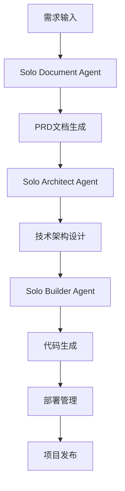

# Trae Solo Code 使用逻辑产品文档

## 1. 产品概述

Trae Solo Code是一个基于AI驱动的智能代码生成和项目管理平台，通过多Agent协作机制实现从需求分析到代码实现的全流程自动化开发。

* 核心目标：简化软件开发流程，提高开发效率，降低技术门槛

* 目标用户：开发者、产品经理、技术团队和初学者

* 市场价值：通过AI辅助开发，将复杂的软件开发过程标准化和自动化

## 2. 核心功能

### 2.1 用户角色

| 角色   | 注册方式 | 核心权限                    |
| ---- | ---- | ----------------------- |
| 普通用户 | 邮箱注册 | 可使用基础AI辅助功能，创建简单项目      |
| 专业用户 | 订阅升级 | 可使用高级功能，多Agent协作，复杂项目管理 |
| 企业用户 | 企业认证 | 团队协作，私有部署，定制化服务         |

### 2.2 功能模块

我们的Solo Code平台包含以下主要页面：

1. **项目仪表板**：项目概览、进度跟踪、Agent状态监控
2. **需求分析页面**：需求输入、自动分析、文档生成
3. **代码生成页面**：智能代码生成、实时预览、版本管理
4. **Agent管理页面**：Agent配置、任务分配、协作监控
5. **部署管理页面**：一键部署、环境配置、监控面板

### 2.3 页面详情

| 页面名称      | 模块名称      | 功能描述                             |
| --------- | --------- | -------------------------------- |
| 项目仪表板     | 项目概览      | 显示项目列表、进度状态、关键指标和快速操作入口          |
| 项目仪表板     | Agent状态监控 | 实时显示各Agent工作状态、任务队列、性能指标         |
| 需求分析页面    | 需求输入界面    | 支持自然语言输入、文件上传、模板选择               |
| 需求分析页面    | 智能分析引擎    | 自动解析需求、生成技术方案、创建任务分解             |
| 代码生成页面    | 代码编辑器     | 基于Monaco Editor的智能代码编辑、语法高亮、自动补全 |
| 代码生成页面    | 实时预览      | 代码变更实时预览、错误检测、性能分析               |
| Agent管理页面 | Agent配置   | 创建、配置、管理不同类型的AI Agent            |
| Agent管理页面 | 任务编排      | 定义Agent工作流、任务依赖、协作规则             |
| 部署管理页面    | 环境配置      | 配置开发、测试、生产环境参数                   |
| 部署管理页面    | 自动部署      | 一键部署、回滚、监控和日志查看                  |

## 3. 核心流程

### 主要用户操作流程

**标准开发流程：**

1. 用户在需求分析页面输入项目需求
2. Solo Document Agent分析需求并生成PRD文档
3. Solo Architect Agent设计技术架构
4. Solo Builder Agent生成代码实现
5. 用户在部署管理页面进行项目部署

**Agent协作流程：**

1. 需求接收 → Solo Document分析 → 生成PRD
2. PRD传递 → Solo Architect设计 → 生成技术方案
3. 技术方案传递 → Solo Builder实现 → 生成代码
4. 代码审查 → 测试验证 → 部署发布

## 4. 用户界面设计

### 4.1 设计风格

* **主色调**：深蓝色(#1e3a8a)作为主色，浅蓝色(#3b82f6)作为辅助色

* **按钮样式**：圆角按钮设计，支持悬停和点击动效

* **字体**：系统默认字体，代码区域使用等宽字体(Consolas, Monaco)

* **布局风格**：卡片式布局，左侧导航栏，顶部工具栏设计

* **图标风格**：简洁的线性图标，支持主题色彩适配

### 4.2 页面设计概览

| 页面名称      | 模块名称    | UI元素                      |
| --------- | ------- | ------------------------- |
| 项目仪表板     | 项目概览    | 卡片式项目展示，进度条，状态标签，操作按钮组    |
| 需求分析页面    | 需求输入    | 大型文本输入框，文件拖拽区域，模板选择下拉菜单   |
| 代码生成页面    | 代码编辑器   | Monaco Editor集成，深色主题，分屏预览 |
| Agent管理页面 | Agent配置 | 表格式Agent列表，配置面板，状态指示器     |
| 部署管理页面    | 部署控制台   | 命令行风格界面，日志滚动显示，操作按钮组      |

### 4.3 响应式设计

平台采用桌面优先的响应式设计，支持移动端适配，针对触屏操作进行了优化，确保在不同设备上都能提供良好的用户体验。

## 5. 多Agent协作机制

### 5.1 Agent类型

* **Solo Document Agent**：专注于需求分析和文档生成

* **Solo Architect Agent**：负责技术架构设计和方案规划

* **Solo Builder Agent**：执行代码生成和实现任务

* **Solo Tester Agent**：自动化测试和质量保证

* **Solo Deploy Agent**：部署和运维管理

### 5.2 协作流程

1. **任务分发**：根据项目需求自动分配给相应Agent
2. **状态同步**：Agent间实时共享工作状态和结果
3. **质量控制**：每个阶段都有质量检查和反馈机制
4. **异常处理**：自动检测和处理Agent协作中的异常情况

## 6. 技术栈支持

### 6.1 前端技术

* React 18+ / Vue 3+ / Angular 15+

* TypeScript支持

* Tailwind CSS / Material-UI

* Vite / Webpack构建工具

### 6.2 后端技术

* Node.js / Python / Java

* Express / FastAPI / Spring Boot

* Supabase / PostgreSQL / MongoDB

* Redis缓存支持

### 6.3 部署平台

* Vercel / Netlify

* AWS / Azure / Google Cloud

* Docker容器化部署

* Kubernetes集群管理

## 7. 最佳实践

### 7.1 项目规划

* 明确定义项目需求和目标

* 合理分解任务和里程碑

* 选择合适的技术栈和架构

### 7.2 Agent使用

* 根据项目复杂度选择合适的Agent组合

* 定期检查Agent工作状态和输出质量

* 及时调整Agent配置和参数

### 7.3 代码质量

* 遵循代码规范和最佳实践

* 定期进行代码审查和重构

* 建立完善的测试覆盖

### 7.4 部署管理

* 建立多环境部署流程

* 实施持续集成和持续部署

* 监控应用性能和用户体验

## 8. 决策流程

### 8.1 需求决策

1. 需求收集和分析
2. 可行性评估
3. 技术方案选择
4. 资源分配决策

### 8.2 技术决策

1. 技术栈评估
2. 架构模式选择
3. 性能优化策略
4. 安全性考虑

### 8.3 质量决策

1. 代码质量标准
2. 测试策略制定
3. 发布标准定义
4. 监控指标设置

